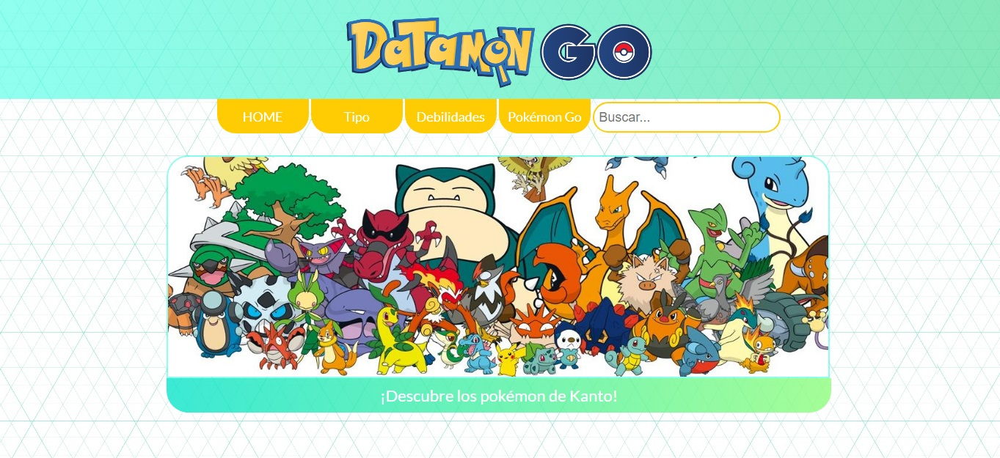

# Datamon GO

**Datamon Go** es una página web donde usuarios frecuentes de la app [Pokémon Go](https://www.pokemongo.com/en-us/) puedan conocer las características de todos los pokémons de la región de Kanto. Por medio de 3 filtros, pueden conocer a los pokémon por tipo, ordenarlos alfabéticamente y por número.

Enlace deploy de [Datamon Go](https://natigrottes.github.io/SCL012-data-lovers/src/index.html)

## Desarrollado para

[Laboratoria](https://www.laboratoria.la/)

## Tecnología y lenguaje utilizado

- JavaScript (ES6)
- Vanilla JS
- HTML
- CSS

## Historias de Usuario

### 1. Definiendo al usuario

*Nota: Para poder conocer el impacto del juego en términos sociológicos y psicológicos, y así lograr mayor comprensión respecto a los usuarios, nos guiamos por el artículo ["The UX of Pokémon GO : A Case Study"](https://medium.com/@pedro_ux/pok%C3%A9mon-go-a-case-for-ux-and-psychology-8b6377db573a), escrito por el UX Consultant Pedro Almeida, publicado en [Medium](https://medium.com/).*

Para contextualizar, la app Pokémon Go, lanzada el 2016, ya cuenta con más de [20 millones de usuarios alrededor del mundo](https://medium.com/@pedro_ux/pok%C3%A9mon-go-a-case-for-ux-and-psychology-8b6377db573a), con usuarios de distintos rangos de edades, intereses y género. 

Tomando en consideración la amplia población de usuarios, decidimos centrarnos en las siguientes interrogantes para poder definir a nuestros usuarios.

1. ¿Quiénes son los principales usuarios de producto?

Nuestro proyecto está dirigido a jugadores frecuentes de la aplicación, sin distinción de género, que estén familiarizados con el lenguaje y dinámica del juego. No es necesario que sean expertos, sino que mantengan un ritmo frecuente de uso de la app. El rango de edades variará entre 14 - 35 años, tomando en consideración una población de nativos digitales. Esto impactará en el diseño e interfaz de nuestro proyecto, ya que nos permitirá saber qué tanta información deseamos poner en la página y cómo debemos ponerla para que logre ser comprendida de forma óptima.

2. ¿Cuáles son los objetivos de estos usuarios en relación con el producto?

Los usuarios frecuentes necesitan consultar las características de los pokémons para que puedan informarse al momento de elegir capturarlos.

3. ¿Cuándo utilizan o utilizarían el producto?

Utilizarían la página al momento de jugar (antes de las batallas o al esperar que aparezcan pokemons), o antes de decidir salir a buscarlos, para tener una idea más clara de lo que se quiere atrapar. También podrían utilizarla después, cosa de conocer más detalles de sus tipos favoritos. Por ende, es necesario que nuestro proyecto sea `responsive` y funcione en desktop, celulares y tablets.

4. ¿Cuáles son los datos más relevantes que quieren ver en la interfaz y por qué?

Para contestar esta pregunta, decidimos hacer una encuesta breve en grupos de jugadores frecuentes y jugadores de la app en específico, tales como en [Pokemon Go Chile](https://www.facebook.com/groups/1736009143333785/), [Gamers](https://www.facebook.com/groups/1720626704877043/), y [Estudiantes UC](https://www.facebook.com/groups/297268223677037/), ya que cumplían con los criterios descritos anteriormente (referente a los rangos de edades, que hayan tanto hombres como mujeres en los grupos, con frecuencia de uso de juego y que sean nativos digitales).

Ir a [Encuesta](https://survey.app.do/que-necesitas-para-complementar-tu-juego-pokemon/NgucyUxE)

Para hacernos una idea de las prioridades de los usuarios, decidimos proponer 5 opciones con distintas características de los pokémons, y luego les pedimos que las ordenaran de más relevante a menos relevante a la hora de jugar Pokémon GO.

Después de un poco más de 24 horas, pudimos obtener **85 respuestas**, las cuales arrojaron los siguientes resultados:

Como se puede apreciar, la mayoría de los jugadores consideran que **conocer las características del Pokémon** es la opción más importante, para así poder decidir más rápido cuál elegir. Este resultado se convertiría en el enfoque principal de nuestras primera Historia de Usuario.

### 2. Definiendo nuestras Historia de Usuario

Para definir cada Historia de Usuario (H.U.), utilizamos 3 parámetros:

**Yo, (usuario)**, **Quiero** (objetivo del usuario), **Para** (propósito de ese objetivo).

Con esto, pudimos construir 4 Historias de Usuario basadas en las opciones de la encuesta, siendo la primera H.U. la que contiene la opción más relevante, tal como se muestra en la siguiente tabla.

Una vez establecidas las H.U., decidimos establecer los `Criterios de Aceptación` y la `Definición de Terminado`.

Por temas de tiempo, decidimos enfocarnos en cumplir solamente con nuestra primera H.U., definiendo los criterios en base a los requerimientos de esa historia. 

## Planificación 

Después de obtener nuestros primeros resultados y definir nuestras H.U., decidimos implementar un [Trello](https://trello.com/b/YBYNtDjD/pokemon-go) para poner nuestros objetivos del proyecto, en base al tiempo y recursos, además del contenido a estudiar y de integrar la planificación semanal. 

Para organizarnos, en el Trello incluímos nuestra H.U. principal con sus respectivos criterios. 

Pincha [acá](https://trello.com/c/Inntb4If) para ir directamente a la pestaña del Trello **Historia 1** de "HISTORIAS DE USUARIO".

Además, decidimos incorporar nuestros objetivos de UX para planificar nuestros test de usabilidad e iteraciones. Esto nos ayudará a dar el puntapié inicial para comenzar nuestro proyecto.

# Definición de terminado

Para poder dar por terminada la primera historia de usuario, debemos haber cumplido los siguientes criterios:

-	El código cumple con la guía de estilos acordada.
-	El código se encuentra en el repositorio.
-	El código tiene y pasa los test necesarios.
-	El código ha recibido feedback de pares, coaches.
-	El código ha sido hecho en pair-programming o se le ha hecho code review.
-	La historia de usuario implementada ha sido probada con al menos 5 usuarios, y se han incorporado las mejoras identificadas en los testeos de usabilidad.

## Diseño de la Interfaz de Usuario

### Prototipos de baja fidelidad

1. Wireframe en Sketch

En primera instancia, decidimos hacer el sketch utilizando papel y lápiz para saber cómo nos gustaría que se viera nuestra web. Decidimos hacer un esquema sencillo y fácil de usar, tomando en consideración que tenemos tiempo limitado para realizar nuestras H.U.

Para este primer prototipo, quisimos implementar un HOME o pantalla de inicio que mostrara el logo, una barra de navegación superior y 3 imágenes que perimitieran mostrar los datos más relevantes para el usuario. Al presionar la imagen principal, pasaría a la segunda pantalla donde se desplegarían todos los pokémons. Además, al hacer click en un pokémon se abriría una ventana modal que mostrara sus características.

2. Mockup en Balsamiq

Con el diseño del sketch en mente, decidimos utilizar la herramienta [Balsamic](https://balsamiq.com/) para digitalizar nuestro wireframe y diseñar un mockup, que permitiera ver la navegabilidad de la página al interactuar con los distintos elementos.

Ver [Prototipo en Balsamic](https://balsamiq.cloud/sijdwql/p9szr7c/rCFBA)

Como se puede observar, este diseño se mantuvo bastante fiel al original, con los filtros correspondientes y las imágenes principales.

### Prototipo de Alta Fidelidad

Para desarrollar nuestro mockup de alta fidelidad, utilizamos [Figma](https://www.figma.com/), para así crear un diseño que fuese fiel a nuestro proyecto final.

Tomando en consideración nuestros prototipos anteriores, decidimos mantener la estructura original, pero esta vez, comenzamos a integrar detalles que ayudaran a cumplir nuestros criterios de aceptación. Considerando que nuestros usuarios son jugadores frecuentes, incorporamos los colores y formas originales de los elementos de Pokémon Go, como el hecho de que se usan bastantes colores en gradiente, y que los botones tienden a ser redondos en vez de la forma cuadrada por default. De esta manera, estamos empleando un lenguaje de la app que el usuario frecuente ya conoce, lo que genera una sensación de familiaridad y confianza en nuestra web, aumentando así las posibilidades de que prefiera utilizarla nuevamente a futuro.

Para cumplir con el objetivo de ser una web responsive, creamos este prototipo para versión desktop y móvil.

Ver [Prototipo de Alta Fidelidad para Desktop en Figma](https://www.figma.com/file/1F7lrcPurj03bRTzu2MEVB/POKEMON-GO)

Ver [Prototipo de Alta Fidelidad para Móvil en Figma](https://www.figma.com/proto/1F7lrcPurj03bRTzu2MEVB/POKEMON-GO?node-id=238%3A2&scaling=scale-down)

Una vez listo, decidimos comenzar a exportar los códigos desde Figma a nuestro CSS, para mantenernos fiel a nuestro prototipo de alta fidelidad.

Este diseño representa el *ideal* de nuestra solución a todas nuestras H.U., por lo que se dejaron enlaces, botones e imágenes sin funcionalidad, ya que priorizamos el cumplir con los criterios de la primera H.U.

### Fundamentos de Visual Design

Respecto a los fundamentos de Visual Design, nuestro prototipo cumple con cada uno de los 4 criterios CRAP:

1. **Contraste**: nos aseguramos de que el color de la fuente de letra fuera legible, utilizando blanco en fondos oscuros, e implementando hover para resaltar el texto. Además, nos preocupamos de no elegir colores demasiado fuertes que saturen al usuario, prefiriendo los azules, verdes y naranjas (aludiendo a la naturaleza, lo que tiene relación directa con el objetivo de "salir a buscar" de la app).

2. **Repetición**: mantuvimos uniformidad en colores, utilizando una paleta basada en la paleta original del juego.Los botones se mantuvieron redondos y nos enfocamos en centrar los elementos para darle mayor simetría a la página.

3. **Alineación**: mantuvimos un márgen constante entre cada tarjeta, y nos preocupamos de que los botones de la barra de navegación superior estuviesen centrados y no se salieran del márgen creado por las imágenes de abajo.

4. **Proximidad**: para este prototipo, pusimos los botones de navegación juntos, así como los selectores de filtro para que fuesen fáciles de encontrar y usar. Como el usuario tiende a leer la pantalla desde arriba hacia abajo, nos preocupamos de poner los filtros en una misma fila superior, y mantener un margen entre esos selectores y el despliegue de las tarjetitas. A su vez, las tarjetas también mantienen un margen y centrado constante, para evitar dispersión y desorden de la data.

Con nuestro prototipo listo, nos pusimos a codear para implementar la interfaz de usuario. Sin embargo, por cosas de tiempo, no pudimos probar nuestros prototipos en instancias formales, pero si pudimos hacerlo con nuestra página lista, tal como se detallará en el siguiente apartado.

## Implementación de la Interfaz de Usuario (HTML/CSS/JS)

Para comenzar nuestro diseño e implementación de usuario final, tuvimos en cuenta los siguientes criterios:

- Mostrar la data en una interfaz: puede ser un card, una tabla, una lista, etc.

Logramos mostrar la data en tarjetas (cards), creando divs para cada pokemon con el HTML dinámico.

- Permitir al usuario interactuar para obtener la infomación que necesita.

Logramos integrar tres tipos de selectores con funciones para filtrar por tipo, orden alfabético (A-Z y Z-A) y orden por número de pokémon (ascendente y descendente).

- Ser responsive, es decir, debe visualizarse sin problemas desde distintos tamaños de pantallas: móviles, tablets y desktops.

Además de integrarlo a tamaño desktop, logramos implementar el responsive con `media query` para tamaños de celulares y dispositivos con un ancho mínimo de 320px y un máximo de 767px.

- Que la interfaz siga los fundamentos de visual design.

Acorde a lo dicho anteriormente, nuestro proyecto sigue con alta fidelidad los 4 criterios CRAP de visual design. Si bien quedaron algunos detalles por arreglar, el diseño es armónico y agradable, además de sencillo de utilizar, tal como lo habíamos establecido en nuestro prototipo de Figma.

Una vez terminado el diseño y la interfaz, nuestra pantalla de inicio y se veía así.

Y la segunda pantalla:

Es importante destacar que nuestra pantalla de inicio no estaba terminada en esta etapa, ya que faltaban las otras imágenes, pero para poder cumplir con nuestra H.U. principal, priorizamos la imagen con el botón que lleva a la segunda página, donde se despliegan los pokémon. La pantalla de inicio es la que más cambios tuvo durante todo el proceso de testeo con usuarios.

## Testeos de Usabilidad

Con nuestra web lista, decidimos emprender nuestros primeros Test de Usabilidad. Para esto, contactamos jugadores que cumplieran con nuestros requisitos de usuario, y los invitamos a testear acorde a una pauta establecida.

1. Saludar al usuario y agradecer su colaboración con nuestro proyecto. Es importante recalcar que no buscamos testear su conocimiento, sino que buscamos recopilar todo el feedback posible que nos pueda entregar para mejorar nuestra web.

2. Nombrar nuestra web y dar una breve definición: "Nuestra web se llama Datamon GO y busca entregar información acerca de pokemons de la región de Kanto".

3. Pedir que nos entregue las primeras impresiones del proyecto, dejando que el usuario hable en voz alta, evitando las interrupciones.

4. Posicionar al usuario con un objetivo: "¿Cómo buscarías los pokemons tipo planta?". Aquí debemos observar y anotar el proceso de búsqueda, por lo que es importante abstenernos de dar demasiadas directrices.

5. Pedir sugerencias y comentarnos las cosas que añadiría o que le gustaría ver en la página, así como también aquello que quitaría.

6. Agradecer su tiempo y su colaboración, recalcando que su feedback nos será muy útil para mejorar nuestra web.

Para la asignación de roles, nos fuimos turnando. A ambas nos tocó tanto hablar con el usuario como anotar los aspectos importantes del testeo.

### Video de Testeo 1 

https://www.loom.com/share/68cb8fce19ce45fd9a659939c913091e

### Video de Testeo 2

https://www.loom.com/share/7a89b83b556943e98c2ce97b3b601077

### Video de Testeo 3

https://www.loom.com/share/6e4218346ea449b39b9603aa614e52e4

### Video de Testeo 4

https://www.loom.com/share/ae545a56411449be983a28dc5bd25f0e

### Video de Testeo 5

https://www.loom.com/share/7bc72da70d4f436db63c1a3b76997a8d

## Feedback de Test de Usabilidad

Los aspectos más comentados fueron:

**1. Aspectos positivos**

- La mayoría de los comentarios fueron positivos respecto al diseño y los colores, los encontraron agradables y armónicos, lo que evitaba el cansancio visual.

- Destacaron el diseño minimalista, mostrando sólo la información pertinente y no bombardeando con demasiados elementos que podrían saturar la visión.

- Destacaron el hecho de que implementamos un buscador, y de que se mantenga en las distintas páginas.

- Les gustó el diseño de las cartas, destacando la interacción del hover y que el tamaño de la letra era legible.

**2. Aspectos a mejorar**

- El botón de la imagen principal del Home pasaba inadvertido. 

Solución: cambiar el color de este botón y ponerlo amarillo para crear uniformidad (acá estamos cumpliendo uno de los criterios CRAP).

- El botón TIPO del Home fue bastante utilizado, sin embargo, como no alcanzamos a implementar esa función, muchos usuarios nos dijeron que sería muy útil que desplegara los tipos, quizás en forma de botones y con ilustraciones, como aparece en la app.

Solución: Habilitar ese botón a futuro, ya que está contemplado para otra H.U.

- A muchos usuarios les gustaría ver las evoluciones, y ojalá verlos de forma única en vez de en grupo.

Solución: como proyección a futuro, se podría implementar una ventana modal para ver al pokémon en más detalle y con más características. Además, podemos implementar una función que entregue las evoluciones de cada pokémon, ya que está previsto para otra H.U. que no logramos completar en este sprint.

- No se entiende a qué se refiere el botón que dice POKÉMON GO de la barra de navegación.

Solución: ser más específicas y poner un texto que diga "ir a aplicación", "descargar Pokémon Go" o "Jugar". Sin embargo, como son usuarios frecuentes, ya cuentan con la app, por lo que sería más útil linkearlo a foros o páginas de jugadores donde se compartan tips del juego.

## Conclusiones finales

- Logramos cumplir con casi todos nuestros criterios para la definición de terminado, lo que nos tiene bastante satisfechas considerando el tiempo y el desafío que implicó el proyecto.

- Si bien no se dieron instancias formales de iterar nuestro prototipo, fuimos modificando el diseño en base a nuestros usuarios, enfocándonos en solucionar sus principales necesidades como jugadores, y preocupándonos de que le página les fuese agradable y familiar.

- Después de los testeos, integramos los cambios a nuestra página final, principalmente mejorando aquellos elementos que corresponden a nuestra primera H.U., pero mantuvimos aquellos elementos que queremos hacer funcionar a futuro para cumplir con el resto de nuestras H.U.

## Desarrolladoras

- Nataly Cuevas
- Katherine Muñoz

